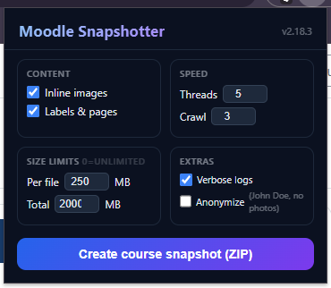

# Moodle Snapshotter

> **AI-Assisted Development Disclosure:**
> 
> This software was developed with the assistance of AI-based code generation tools via OpenCode. AI-generated suggestions were used as part of the development process, but all generated code and related outputs were reviewed, tested, modified where necessary, and approved by a human operator before release.
> 
> This disclosure is provided for transparency. The published software remains under the responsibility of the human operator or organisation releasing it.


One-click Chrome extension that downloads an entire Moodle course into an offline ZIP archive — files, folders, URLs, pages, forums, assignments, inline images, and a searchable index.


## Features

- **Full course capture**: files (PDF, PPT, DOCX, etc.), folders (ZIP download + recursive crawl), URLs (.url shortcuts), pages/labels (HTML snapshots), forums (discussions + attachments), assignments (submission files), inline images, wiki pages
- **16 Moodle module types** detected and handled
- **Privacy mode**: optional anonymization — replaces names with "John Doe", profile pictures with colored circles, strips submission content, database tables, session tokens, user IDs, and more
- **Concurrent downloads**: configurable 1–12 parallel threads
- **Size limits**: per-file max, total max, 10,000 file hard cap
- **Smart compression**: auto-switches to STORE (no compression) for archives >80 MB to prevent memory crashes
- **Cancellable**: stop anytime — saves partial ZIP with what was downloaded so far
- **Searchable index**: dark-themed `00_index.html` with stats dashboard and live client-side filter
- **Debug output**: `log.txt` and `discovery.json` in every ZIP

## Installation

1. Clone or download this repo
2. Open Chrome → `chrome://extensions`
3. Enable **Developer mode** (top-right toggle)
4. Click **Load unpacked** → select the project folder
5. The extension icon appears in your toolbar

> Currently configured for `moodle.uclouvain.be`. To use on another Moodle instance, edit `manifest.json` → `host_permissions` and `matches`.

## Usage



1. Navigate to any Moodle course page
2. Click the extension icon → a settings popup appears
3. Configure options:
   - **Content**: inline images, labels/pages
   - **Speed**: concurrency (threads), crawl depth
   - **Size limits**: per-file max (MB), total max (MB)
   - **Extras**: verbose logs, anonymize output
4. Click **Create course snapshot (ZIP)**
5. A progress overlay appears in the bottom-right corner
6. When complete, click **Save ZIP** to download

## ZIP Structure

```
CourseSlug__YYMMDD-HHMM[-anon].zip
├── 00_index.html          Searchable index with stats dashboard
├── 01_Files/              Downloaded course files
├── 02_Folders/            Folder contents (ZIP or crawled)
├── 03_URLs/               External URL shortcuts
├── 04_Notes_Pages/        HTML snapshots of pages, forums, labels
├── 05_Inline_Images/      Images from course content
├── 06_Assignments/        Assignment submission files
├── 07_Forums/             Forum post attachments
├── 08_Wikis/              Wiki page attachments
└── 99_Debug/              log.txt + discovery.json
```

## Anonymization

When enabled, the output is scrubbed before packaging:

| Data | Replacement |
|------|-------------|
| Student/staff names | `John Doe 1`, `John Doe 2`, ... |
| Profile pictures | Colored HSL circles (unique per user) |
| Email addresses | `anonymous@example.com` |
| Session keys | `[removed]` |
| User IDs | `0` |
| Profile links | `#` |
| GitHub URLs | `[GitHub link removed]` |
| Database activity pages | Full body replaced |
| Assignment submissions | Directory removed entirely |
| Choicegroup rosters | Names replaced, group structure preserved |

## Architecture

See [DESIGN.md](DESIGN.md) for the full architecture document covering:
- 5-phase pipeline (Discovery → Work Queue → Download → Anonymize → ZIP & Save)
- Module detection via Moodle 4.x CSS classes
- Concurrency limiter design
- Filename resolution and mojibake repair
- Anonymizer operation table (21 scrubbers)
- Security hardening (XSS, ZIP-slip, error sanitization)

## Development

```
content.js        Main engine (1177 lines)
anonymizer.js     Privacy scrubber (118 lines)
background.js     ZIP download relay (59 lines)
popup.html/js     Extension popup (86 + 58 lines)
libs/jszip.min.js JSZip v3.10.1 (vendor)
```

## License

MIT
